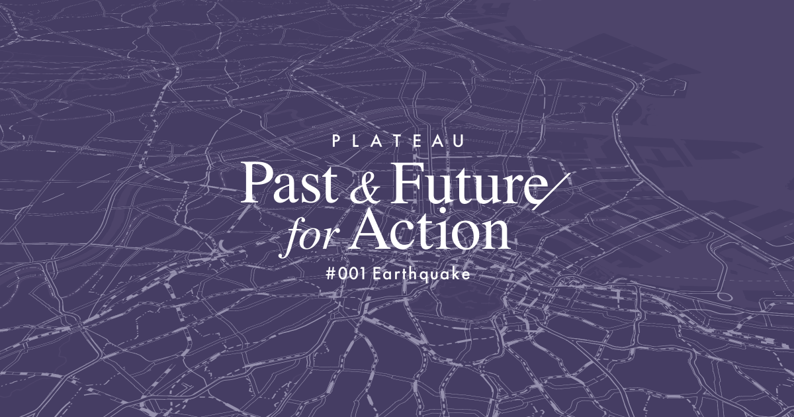

# ストーリーテリング型 WebGIS 「PLATEAU Past & Future for Action」

  
本レポジトリでは、3D都市モデルを活用したストーリーテリング型WwbGISコンテンツ「PLATEAU Past & Future for Action」のソースコードを公開しています。  
「PLATEAU Past & Future for Action」は、WebGIS コンテンツにおける表現の新しい可能性を示すことを目的に開発されたサンプルアプリです。WebGISにおける多様なビジュアライゼーション表現を実現するため、本コンテンツは東京都の首都直下地震等の災害リスクを伝えることをテーマに、自動遷移型のストーリーテリングアプリケーションとして構築されています。  
WebGISエンジンとしてはdeck.gl と MapLibre GL JS を組み合わせて使用しました。

### [PLATEAU Past & Future for Action （外部リンク）](https://www.mlit.go.jp/plateau/plateau-pffa/)

詳細は[技術調査レポート](https://www.mlit.go.jp/plateau/file/libraries/doc/plateau_tech_doc_0058_ver01.pdf)を参照してください。

  
## 構成

- `app/` ディレクトリ配下には、実際の Web アプリケーションとして動作するコードが置かれている。
- `plateau_citygml_to_mvt/` ディレクトリ配下には、PLATEAUで提供される2023年度の建物モデルの CityGML を MVT に変換するためのコードが置かれている。

## 必要なツール

- Node.js: バージョン 20.11.1 以上
- Yarn: バージョン 1.22.22 以上
- tppeacanoe: バージョン 2.42.0 以上、 `plateau_citygml_to_mvt` を起動する場合のみ必要。

## 起動方法

### Web アプリケーションの起動方法

事前に `app/.env.example` を参考に `.env` を作成する。
  
次に、 Web アプリケーションは以下のように起動する。

1. `yarn install`
2. `yarn dev`

### CityGML を MVT へ変換するスクリプトの起動方法

事前に G空間情報センターから東京都 23 区 3D 都市モデルの 2023 年度の CityGML をダウンロードし、`plateau_citygml_to_mvt/data/plateau_citygml_2023` のように配置する。  
  
次に、 CityGML を MVT へ変換するために以下のスクリプトを実行する。

1. `yarn install`
2. `yarn convert`
3. `tippecanoe -pC -ad -an -aD -pf -pT -Z10 -z16 -e dist -l tokyo23-mvt -ai --hilbert tokyo23.geojsonl`

上記を実行後、 `plateau_citygml_to_mvt/` ディレクトリは以下に `dist/` ディレクトリが生成され、このディレクトリに MVT のファイル群が入っている。  
  
新しく生成した MVT を本アプリケーション上で確認する場合は、生成した `dist/` ディレクトリの名前を `tokyo23-mvt` に変更した上で `app/public/data/` ディレクトリ配下に配置する。

## ライセンス
ソースコード及び関連ドキュメントの著作権は国土交通省に帰属します。  
本ドキュメントは[Project PLATEAUのサイトポリシー](https://www.mlit.go.jp/plateau/site-policy/)（CCBY4.0及び政府標準利用規約2.0）に従い提供されています。

## 注意事項
本リポジトリは参考資料として提供しているものです。動作保証は行っていません。  
本リポジトリについては予告なく変更又は削除をする可能性があります。  
本リポジトリの利用により生じた損失及び損害等について、国土交通省はいかなる責任も負わないものとします。  

## 参考資料
技術検証レポート: https://www.mlit.go.jp/plateau/file/libraries/doc/plateau_tech_doc_0058_ver01.pdf
